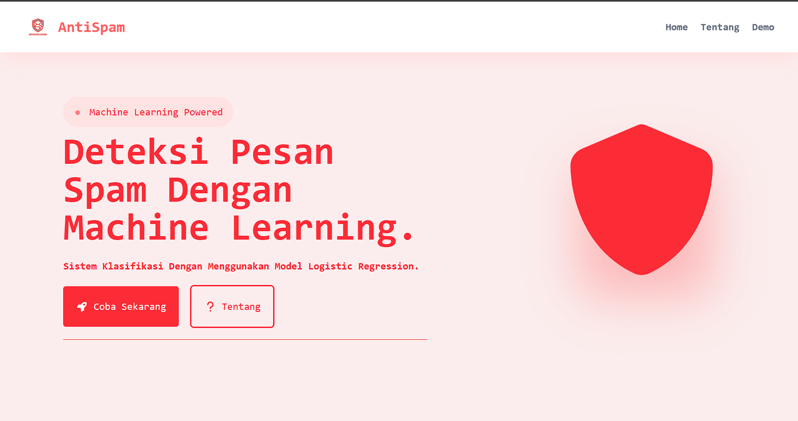
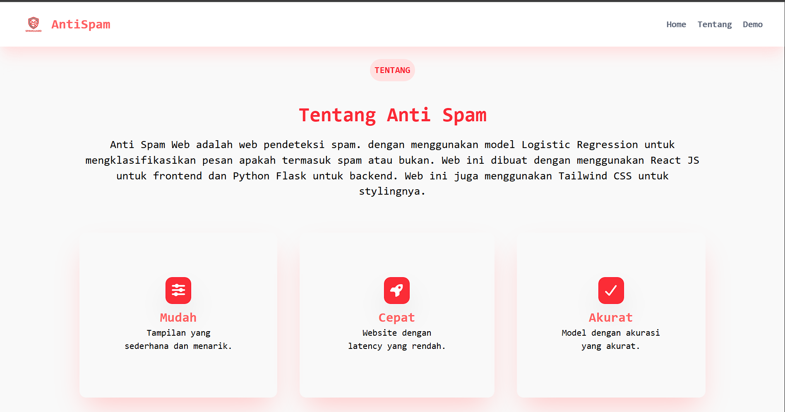
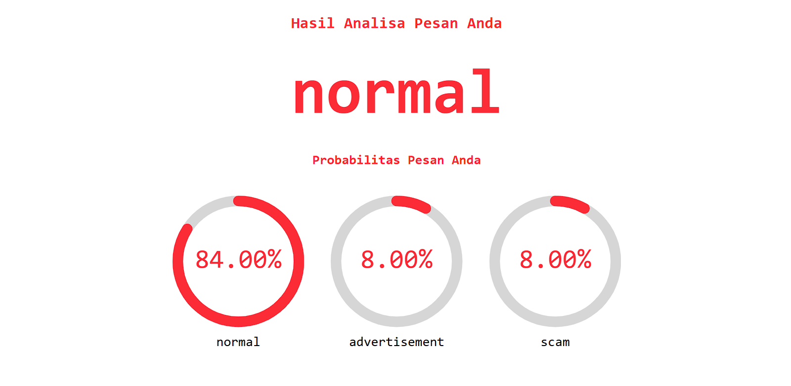

# SPAM DETECTION WEB

<p>Created by R1TGAMING / Ipii</p>

---

## Image





## Description

Project ini dibuat untuk mendeteksi apakah sebuah pesan termasuk normal, iklan. atau penipuan. Dengan menggunakan model machine learning, proyek ini dapat membantu pengguna untuk mengidentifikasi pesan yang mencurigakan dan melindungi diri mereka dari potensi ancaman.

## Installation

1. Clone repository ini ke komputer Anda.

```
git clone <repository-url>
```

2. Install dependencies yang diperlukan.

di folder frontend:

```
npm install
```

di folder backend:

```
pip install -r requirements.txt
```

3. Jalankan backend server.

```
python app.py
```

4. Jalankan frontend server.

```
npm start
```

5. Akses aplikasi melalui browser dengan membuka `http://localhost:5173`.

## Penggunaan

Aplikasi bersifat open source jadi semua orang berhak untuk menggunakan dan memodifikasi sesuai kebutuhan. Anda dapat mengirim pesan melalui antarmuka pengguna dan aplikasi akan memberikan hasil deteksi apakah pesan tersebut termasuk normal, iklan, atau penipuan.
